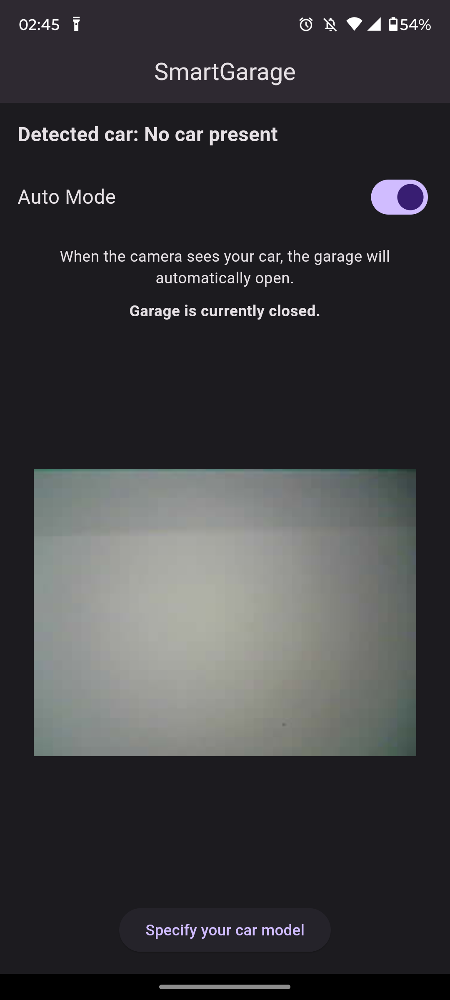

# SmartGarage

This repository contains the code and libraries for my Smart Garage system, developed as part of my final thesis project at the Faculty of Information Technologies, University "Džemal Bijedić" in Mostar. The project demonstrates the integration of AI and Machine Learning on low-cost hardware to automate and control a garage system.

## Project Overview

The system is powered by an ESP32-CAM module running the FOMO (Faster Objects More Objects) algorithm, which detects the owner’s car and automatically opens and closes the garage. The system can recognize other vehicles, but only the authorized car is allowed to open the garage.
Features:

Mobile App: Built using Flutter, the app allows users to monitor the garage, view the live camera stream, and control the garage in automatic or manual mode.
- Automatic Mode: The garage opens/closes based on the detection of the owner’s car.
- Manual Mode: Users can manually open and close the garage from the app.
- ESP32-CAM: Handles object detection using the FOMO algorithm to recognize vehicles.
- ESP-12F Module: Controls the garage motor.
- Firebase Realtime Database: Facilitates communication between the ESP32-CAM, ESP-12F, and the mobile app.

## Repository Contents

This repository contains all the code required to run the system:

- ESP32-CAM: Code for object detection and communication with Firebase.
- ESP-12F: Code to control the garage motor and receive commands.
- Mobile App (Flutter): Code for the user interface and interaction with Firebase.
- Libraries: Including the trained FOMO model created on the Edge Impulse platform, which is used by the ESP32-CAM for object detection.

## Getting Started

Clone the repository:

```bash
git clone https://github.com/EsrefPivcic/SmartGarage
```

- Train and modify the FOMO model as needed on the Edge Impulse platform, or use the provided pre-trained model (```libraries/SmartGarageESP32Cam_inferencing```).
- Set up the ESP32-CAM and ESP-12F modules with the provided code (specify your ```WIFI_SSID``` and ```WIFI_PASSWORD```, as well as Firebase ```API_KEY``` and ```DATABASE_URL```).
- Build the Flutter mobile app and connect it to the Firebase project (```mobile_app/smart_garage/android/app/google-services.json``` and ```mobile_app/smart_garage/android/app/src/main/res/values/values.xml```).

## Screenshots

<details>
  <summary>Mobile App</summary>

  
  
  
  
  

</details>

## License

This project is licensed under the [MIT License](LICENSE).
